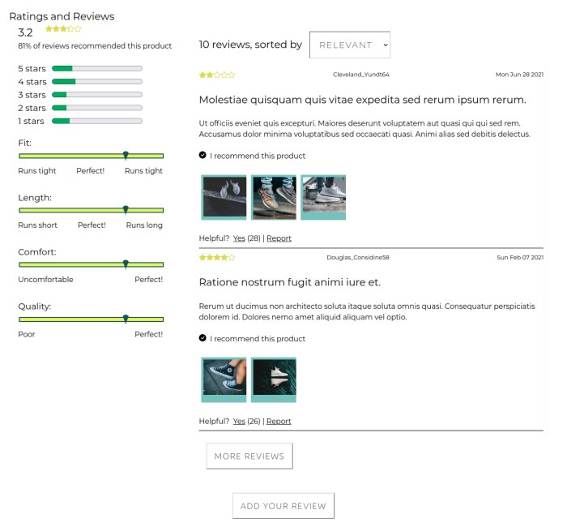

A simple demo of this project can be found (for now...) [here](http://204.236.152.139/)


# "Project Catwalk" - Ascent Squad

## Background

*Project Catwalk* is the Frontend Capstone project for the Hack Reactor software engineering immersive program.

This repo contains the submission for **Ascent Squad**, a team consisting of the following developers:

- Sam Pool
- Fanno Chea
- Yunfan Gao

These three developers were given roughly 2.5 weeks to build out the front end of the product view of an ecommerce portal from scratch according to a Business Requirements document and a design document.

---

### The API

Included in this assignment was a provided API with multiple endpoints which respond to requests with varying types of information - general product info, product styles, questions & answers, and ratings & reviews.

The responsibility of Ascent Squad was to harness this provided API to build out a fully functioning product view frontend.

---

## Primary Technologies

This project was built using the following primary technologies

- ReactJS
  - Frontend javascript framework used to build the user interface.
- Babel
  - Transpilation package used to convert ReactJS-specific syntax into browser-consumable JavaScript.
- Webpack.
  - Bundling package used to bundle javascript modules and component-focused stylesheets into ```.js``` and ```.css``` bundles for browser comsumption.
- NodeJS + ExpressJS
  - Backend javascript framework used to build a basic server for serving static files and making authenticated API requests on behalf of the client.
- Jest + React-Testing-Library
  - Testing framework and library used for unit tests, integration tests, and end-to-end tests.

---

## Installation

Steps for getting started as a developer on this repo:

1. Clone this repo onto your local machine:
    - ```git clone https://github.com/ascentSquad/projCatwalk.git```
2. ```cd``` into the repo's root directory
3. Install the project's depencies:
    - ```npm install```
4. Start developing!

---

## Provided Scripts

- ```npm run react-dev```
  - bundles the contents of the ```src/``` directory (also transpiling JavaScript as needed for browser consumption) into bundled ```.js``` and ```.css``` files which are linked into the ```index.html``` page, then __watches for changes and re-bundles on each file change.__
- ```npm run react-server```
  - starts a development server which serves the client app from localhost - be default on ```localhost:3000``` - then __watches for changes and restarts the server with updated content on each file change__.


---

## Project Structure


- ```client/```
  - files related to the ReactJS client application
  - ```dist/```
    - static bundled and transpiled files to be served as the client application
  - ```src/```
    - source files for the client application
    - ```components/```
      - ReactJS component files (```.jsx```) and their associated style sheets (```.css```) and jest test suites (```.test.js```), organized by component.
    - ```contexts/```
      - files related to app state management, handled by ReactJS' context feature.
    - ```dummyData/```
      - data matching the shape and content returned from the various API calls for use in development and testing.
    - ```App.jsx```
      - The parent client application component which renders all child components.
    - ```App.test.jsx```
      - tests for the parent app component - the bulk of the app's tests are dispersed throughout the ```components/``` directory structure, organized by the component they test.
    - ```index.js```
      - the root JavaScript file of the webpack bundle - imports the ```App.jsx``` file and injects it into the ```/client/dist/index.html``` page.

- ```server/```
  - files for the minimal ExpressJS server application (API exists   seperately)
- ```.vscode/```
  - shared editor settings for VS Code

- etc...
  - config files for webpack, babel, jest, etc

---

## The "Widgets"

Apart from the overall architecture of the app, which was developed as a group effort, the app content was split into three "widgets", each of which was tackled by a specific developer, as a way of dividing the work.

The three widgets and their developers (in the order they appear in app) are as follows:

- Product Overview
  - Sam Pool
- Questions & Answers
  - Yunfan Gao
- Ratings & Reviews
  - Fanno Chea

---

### Product Overview
- Developer: Sam Pool

The Product Overview widget is the featured "above-the-fold" component showcasing the current product. The primary sub-components of this widget are as follows:

- Img Gallery
  - Displays images of the current product in the style currently selected (see below - Style Selector).
  - Includes navigation arrows to flip through images one at a time
  - Includes thumbnail carousel, an alternate option for navigating through the images
- Style Selector
  - Allows the user to select different styles for a given product - variations in color, etc.
  - Displays available styles as a list of thumbnails which can be selected from.
- Size selector
  - Allows the user to select a size for the current product.
  - sizes are dependent on the sizes in stock for the selected style.
- Quantity Selector
  - Allows the user to select a quantity of the current product.
  - Quantities are dependant on quantities currently in stock for selected style and size.
- Add To Cart
  - Allows the user to add the selected quantity of this product in selected style and size to their shopping cart - accomplished through a POST request to the independent API.
---

### Questions & Answers
- Developer: Yunfan Gao

The Questions & Answers section is the second/middle section on the page. It displays a list of the questions and associated answers related to the product that other people have asked and answered, and where you'll find the ability to ask your own question or to post your own answer.

- 'QuestionContext' component
  - Gathers question and answer data via API call
  - Gathers methods that could used to add question and answers
  - Fetch the data in a sorted way
- 'QAndA' parent component
  - Receive the Q&A data from Question Context
  - Display two sections, search-bar section and question-list section.
  - Connecting the two child sections via a search keyword
- 'SearchBar Section'
  - Displays a search bar used to search keyword within question statement
  - Include css and test file within the sear
- 'QuestionList section'
  - Display the question list and the content within it
- 'QuestionList component'
  - The root of QuestionList section, layout the subcomponent within the section
  - Receive the search key word from search bar
  - Display the Question statement
- 'Helpful component'
  - First sub component within QuestionList
  - A helpful button and an add-answer button display on the upperright corner.
- 'AnswerList component'
  - Second sub component within QuestionList
  - Used to display a list of answers related to the particular question
- 'AnswerForm component'
  - The sub component within Helpful component
  - A form used to enter the details related to an answer to be posted on broswer
- 'EachAnswer component'
  - The sub component within AnswerList component
  - Used to display the detail of each answer
- 'QuestionForm component'
  - A button can be clicked on to add a question, and the QuestionForm component will pop up to let use enter the detail about the question related to product

The above mentioned components reside in the /client/src/components/QAndA/ subfolder

### Ratings & Reviews
- Developer: Fanno Chea

The Ratings & Reviews section is the last/bottom-most section on the page. It displays the reviews of the product that other people have submitted, some brief statistics on their reviews/ratings and product characteristics, and where you'll find the ability to submit your own review.

- 'RatingsReviews' parent component
  - Gathers review data via API call
  - Houses a Modal component usage by reviews' images, and review form
- 'ReviewForm'
  - Confirms that mandatory fields are filled out before data is POSTed to an API endpoint
- 'RatingsBreakdown'
  - Displays various product statistics via an intuitive visual
  - Allows for filtering review data via score/rating
- 'ReviewsList'
  - Allows user to select a sort/order for the reviews
  - Houses/creates an individual 'Review' component for each user review
- 'Review'
  - Displays the actual content of a single user review: username, date, summary and body, images, overall rating/score
  - Users also have the ability to provide feedback when a review is helpful; or report a review if it's not.

The components reside in the /client/src/components/RatingsReviews/ subfolder

Screenshot:

  

---

## Misc Components

---
- AnalyticWrapper
  - This component wraps all of the app's child components (widgets) and captures data for every user click in the app. For each click, the following data is captured:
    - Time of click
    - Click target - Widget (Either ProductOverview, QAndA, or RatingsReviews)
    - Click target - Specific HTML Element
  - Currently this data is captured and recorded in memory, but not on disk. A more persistant implementation would be simple given the appropriate backend funcionality.
---
- StarRating
  - A component to be reused throughout the application - displays a scalar rating as a series of stars of a 5-star grading scale
  - It parses a value between 0 and 5, and fills the stars to the nearest .25/quarter value.
---
- Modal
  - Allows modal-type display of any component or HTML element passed in as a ```component``` prop.
  - **NOTE:** Modal relies on an external React state and its associated state setter method. The ```component``` prop should be derived from a state in the rendering component, and the ```setComponent``` prop should be a setter method which can set that state (this allows the modal to remove itself from the DOM when a click occurs outside of the rendered child).

_**Example Usage:**_
```javascript
//import Modal into the component which should render the Modal
import { Modal } from '../Modal/Modal.jsx';

function myComponent(props){

  // Create a modal state within your own component:
  const [modalState, setModalState] = useState(null);

  // Create a function responsible for inserting your desired React Component or HTML element into your modal state
  function handleModal(){

    setModalState(
      <MyModalChildComponent
        prop1={prop1value}
      />
    );

  }

  // Render your parent component as your normally would:
  return (
    <div>

      {// Pass in the state & setter as props to Modal}
      <Modal
        component={modalState}
        setComponent={setModalState}
      >

      {// In this example we use a click event to fire the Modal handler}
      <button onClick={handleModal}>
        Open My Modal
      </button>

    </div>
  )
}
// ^ When the button is clicked, the handleModal function will set the modalState to the specified Component, which will automatically trigger MyChildComponent to be rendered inside of the modal in the DOM
// If the user clicks anywhere outside of MyChildComponent while the modal is open, the Modal will automatically set modalState to null, which removes the modal from the DOM
```
---
## Contexts

### ProductContext

ProductContext is the combined data of two API calls, each of which is represented by a key on the context value:
- ```currentProduct```
  - result of calling ```serverRequests.getProductById(productId)```
  - includes keys:
    - ```campus``` (String)
    - ```category``` (String)
    - ```created_at``` (String)
    - ```default_price``` (String)
    - ```description``` (String)
    - ```features``` (Array)
    - ```id``` (Number)
    - ```name``` (String)
    - ```slogan``` (String)
    - ```updated_at``` (String)

- ```reviewsMetadata```
  - result of calling ```serverRequests.getProductReviewsMeta(productId)```
  - includes keys:
    - ```characteristics``` (Array)
    - ```product_id``` (String)
    - ```ratings``` (Object)
    - ```recommended``` (Object)

**Example Usage:**

``` javascript
import { ProductContext } from '../../contexts/product-context';

function myComponent(){

  // In this example, we destructure both properties off the context object:
  const { currentProduct, reviewsMetadata } = useContext(ProductContext);

  // We can then access individual values off the destructured keys:
  let productName = currentProduct.name;
  // ...
}
```
---
### QueryContext

The QueryContext allows all components to have access to parsed query parameters in the URL.

Query parameters are seperated from the URL path endpoint by a "```?```" and are seperated from each other by a "```&```". Within each query parameter, a key and value is parsed by a seperating "```=```". If there no ```=```, the parameter will be treated as a key with a value of ```'true'```.

To illustrate this, consider this example:

**Example URL:** ```example.com/endpoint?query1=true&query2=aString&query3```

**Resulting QueryContext**:
``` javascript
{
  query1: 'true',
  query2: 'aString',
  query3: 'true',
}
```
The QueryContext is provided at the top level of the app, meaning any component can access it by importing it from ```client/src/contexts/product-context.js```.

**Example Usage:**

``` javascript
import { QueryContext } from '../../contexts/product-context';

function myComponent(){

  // In this example, params is a variable containing all current QueryContext data
  const params = useContext(QueryContext);

  // Here we are checking for a 'example' query param with a true value - if one exists, we will call the doSomething() function
  if (params.exampleQuery){
    doSomething();
  }
  // ...
}
```
**NOTE:** In the above example - a URL to run ```doSomething()``` could look something like this:
```example.com/example-endpoint?exampleQuery ```
